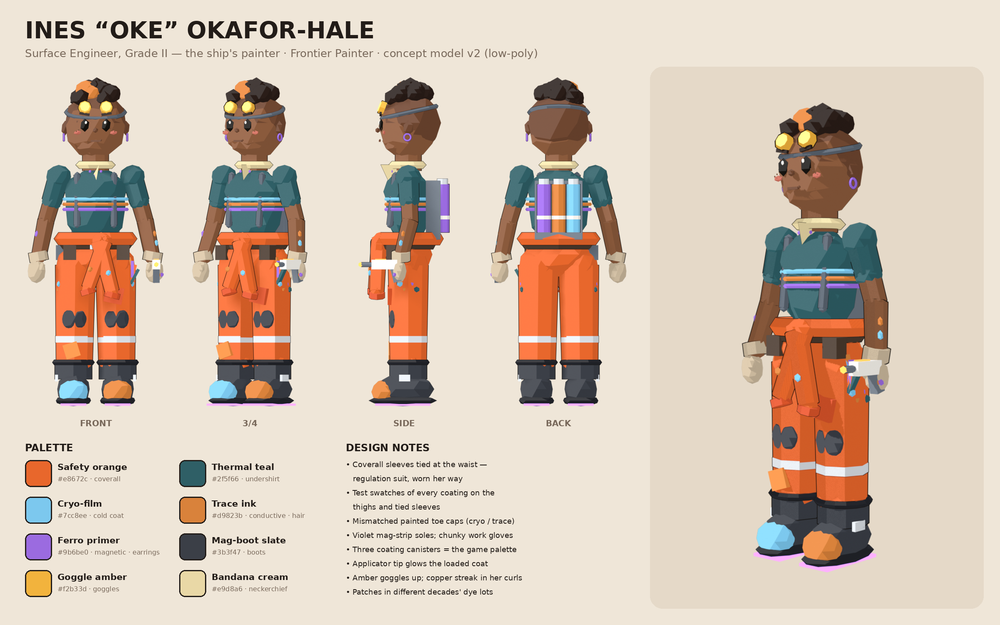

# Character concept: Ines "Oke" Okafor-Hale

Concept model of the protagonist (see `docs/STORY.md`). Not in the game yet —
this is for visual development and, later, as a placeholder in Babylon.



## Sketches

Neo-anime concept sketches (model sheet, expressions, at work, in the Paint
Locker) are in [`sketches/`](sketches/) — thumbnails plus links to the
full-resolution Canva originals.

## Files

| File | What |
|---|---|
| `build_ines.py` | The model. Procedural Blender script: every part is a primitive, so shapes/colours are edited in code (palette at the top). |
| `make_sheet.py` | Composes `out/ines_sheet.png` from the renders (turnaround + hero + palette + notes). |
| `out/ines.glb` | Plain-PBR glTF for development (Y-up, metres, ~1.62 m, faces -Z in glTF / -Y in Blender). No outline shells; glowing parts carry emissive. |
| `out/ines.blend` | The built scene, cel shading + ink outlines intact. |
| `out/ines_{front,threequarter,side,back,hero}.png` | Renders (transparent background). |

## Rebuild

```sh
LC_ALL=C LANG=C blender -b --python-exit-code 1 -P art/character/build_ines.py -- art/character/out
python3 art/character/make_sheet.py
```

(`LC_ALL=C` avoids an OpenColorIO locale crash seen with headless Blender on
this machine.) EEVEE, orthographic turnaround; ~1 min total.

## Style

*Caravan SandWitch*-leaning: chunky rounded proportions (~5 heads), oversized
boots and gloves, 3-band cel shading (Diffuse → Shader to RGB → constant ramp)
with inverted-hull ink outlines, warm sand backdrop. Utilitarian first, with the
fashion twist she can get away with under regulations: coverall sleeves tied at
the waist, patterned bandana, mismatched painted toe caps, ferro earrings, a
trace-ink copper streak, goggles worn up.

## Using it in Babylon (later)

`SceneLoader.ImportMeshAsync("", "/art/", "ines.glb", scene)` — then add
Babylon's outline/toon look if wanted (e.g. `renderOutline` or a cel shader).
The GLB is 215 separate meshes (~5.6 MB); for in-game use, join meshes by
material and drop the subdivision level in `build_ines.py` (`sub=`) first.
No rig yet — A-pose, ready for Mixamo/Rigify if she gets animated.
